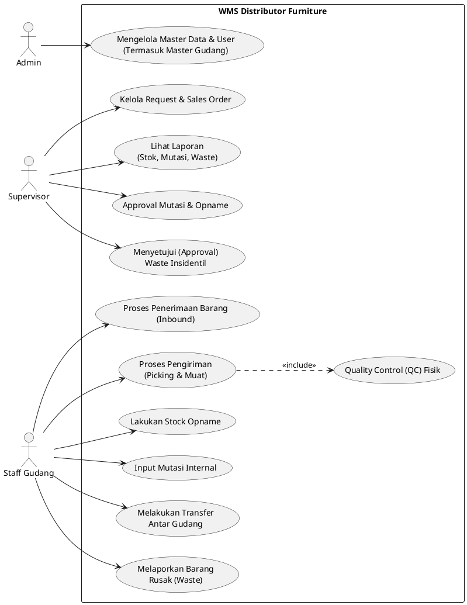

# Chat Conversation

Note: _This is purely the output of the chat conversation and does not contain any raw data, codebase snippets, etc. used to generate the output._

### User Input

@[c:\xampp\htdocs\wms_funitur\Investigating Inventory Stock Visibility.md] nah coab adna baca dan phami tekrait yang dikejrkana ini secara detail dan rinci untuk tau apa yang sendag dikejrkaan 

*Viewed [Investigating Inventory Stock Visibility.md](file:///c:/xampp/htdocs/wms_funitur/Investigating%20Inventory%20Stock%20Visibility.md) *

### Planner Response

Berdasarkan percakapan di dalam file `Investigating Inventory Stock Visibility.md` yang Anda berikan, berikut adalah penjelasan detail mengenai apa yang sedang/baru saja dikerjakan pada sistem (WMS Gudang Furniture):

**Latar Belakang Masalah:**
Awalnya, Anda menyadari bahwa informasi mengenai "stok per barang" (stok siap pakai/ready, stok karantina, dll) sepertinya tidak ada di sistem. 

Asisten AI menjelaskan bahwa fitur tersebut sebenarnya sudah ada di:
1. `master_furniture.php` (Hanya bisa diakses oleh **Admin**).
2. Fitur "Kartu Stok" di `inventory.php` (untuk melihat detail mutasi masuk/keluar barang).

Namun, Anda memberikan masukan yang sangat bagus: **Informasi sisa stok dan karantina seharusnya bisa dilihat oleh semua pengguna (Staff Gudang, Supervisor), tidak hanya terbatas untuk Admin di halaman Master Barang.**

**Pekerjaan yang Telah/Sedang Diselesaikan:**
Untuk mengakomodasi permintaan Anda, sistem telah dimodifikasi dengan melakukan penambahan fitur **"Informasi Stok"** yang bersifat publik (dapat dilihat semua _role_ pegawai). Berikut detail implementasinya:

1. **Pembuatan Halaman Baru (`informasi_stok.php`):**
   * Dibuat sebuah halaman khusus yang berisi tabel daftar seluruh barang/furniture.
   * Tabel ini menampilkan jumlah **stok tersedia (Ready)**, **stok karantina (rusak/diasingkan)**, serta informasi **lokasi (letak rak/blok)**.
   * Halaman ini dibuat bersifat **Read-Only** (hanya untuk melihat data saja, tidak ada fitur tambah/edit/hapus), sehingga aman diakses oleh selain Admin.

2. **Pembaruan Navigasi Sidebar (`sidebar.php`):**
   * Menu baru bernama **"Informasi Stok"** telah ditambahkan ke bilah samping (sidebar).
   * Menu ini diletakkan di bawah kelompok menu **Gudang & Logistik**.
   * Hak akses menu ini telah diatur agar bisa dibuka oleh **semua _role_** (Admin, Supervisor, dan Staff Gudang).

3. **Mempertahankan Fitur Lama:**
   * Halaman Master Data Barang (`master_furniture.php`) tetap dipertahankan dan tetap dibatasi hanya untuk Admin (karena di sana Admin bisa mengelola/mengedit data barang).

**Intinya:** Pekerjaan yang baru saja diselesaikan adalah **mendemokratisasi data stok**, sehingga Staff dan Supervisor gudang sekarang memiliki halaman khusus (`informasi_stok.php`) untuk melihat sisa ketersediaan barang dan letak raknya tanpa perlu meminta akses Admin. 

Anda dapat memuat ulang (refresh) halaman aplikasi web Anda untuk melihat menu "Informasi Stok" yang baru di bagian kiri bawah (Gudang & Logistik). Apakah ada hal lain terkait fitur ini yang ingin Anda periksa atau modifikasi lebih lanjut?

### User Input

nah dari masukkan doessne ada tewrkati mutasi atau transfer antar gudang, dari gemin iseperti ini
Kamu adalah Expert Fullstack Developer. Tolong bantu saya memperbarui sistem "WMS-Furni Enterprise Edition" (PHP Native, PDO SQLite3, Tailwind CSS).

KONTEKS MASALAH:
Sistem kita baru saja di-review oleh dosen penguji untuk persiapan UAS. Beliau mengapresiasi alur transaksi yang ada, namun memberikan satu revisi krusial: "Di sistem ini kurang ada mutasi atau transfer antar gudang." 

Sebelumnya, kita hanya memiliki "Mutasi Internal" (pindah rak/blok). Sekarang, dosen meminta fitur "Transfer Antar Gudang" (contoh: Pindah dari Gudang Pusat ke Gudang Cabang A).

TUGAS UTAMA:
Tolong buatkan kode PHP, query SQLite, dan UI Tailwind untuk menambahkan fitur "Transfer Antar Gudang" TANPA merusak alur PO, SO, dan Waste Management yang sudah ada. Berikut spesifikasinya:

1. UPDATE DATABASE (Skema Multi-Gudang Sederhana)
- Buat tabel baru `tb_gudang`: id_gudang (PK), nama_gudang, alamat, jenis ('Pusat', 'Cabang').
- Modifikasi tabel yang menyimpan stok (jika perlu) ATAU cukup tambahkan pencatatan di `tb_mutasi_stok`. 
- Di `tb_mutasi_stok`, pastikan bisa merekam log transfer. Tambahkan kolom (jika belum ada): `id_gudang_asal` (nullable) dan `id_gudang_tujuan` (nullable).
- Buatkan query inisialisasi (INSERT dummy) untuk minimal 2 gudang: "Gudang Pusat (Main)" dan "Gudang Cabang (Hub)".

2. UPDATE MASTER DATA (UI/UX)
- Buatkan file `master_gudang.php` (CRUD sederhana untuk mengelola daftar gedung/gudang).
- Tambahkan menu "Data Gudang" di Sidebar pada grup "MASTER DATA".

3. BUAT FITUR TRANSFER ANTAR GUDANG (`transfer_gudang.php`)
- Letakkan menu ini di Sidebar pada grup "GUDANG & LOGISTIK" (bisa menggantikan/menggabungkan menu Mutasi Internal sebelumnya menjadi "Mutasi & Transfer Gudang").
- Halaman ini menampilkan riwayat/tabel Transfer Antar Gudang.
- Sediakan Form Input Transfer dengan field: 
  a. Pilih Barang (Dropdown)
  b. Gudang Asal (Dropdown)
  c. Gudang Tujuan (Dropdown) -> Validasi JS/PHP: Gudang Tujuan tidak boleh sama dengan Gudang Asal.
  d. Qty Transfer (Input Number)
  e. Keterangan (Text)
- LOGIKA PHP TRANSAKSIONAL: Saat di-submit, pastikan Qty tidak melebihi stok yang ada. Catat pergerakan ini ke dalam `tb_mutasi_stok` sebagai jenis_mutasi = 'TRANSFER_OUT' (dari gudang asal) dan 'TRANSFER_IN' (ke gudang tujuan).

4. KONSISTENSI UI
- Gunakan desain Premium Corporate Navy yang sama dengan sistem saat ini (bg-slate-50, komponen card putih putih, tombol biru/navy). 
- Pastikan form input dibungkus dalam transaksi database try-catch PDO agar aman.

Berikan saya kodingan lengkap untuk inisialisasi tabel SQLite barunya, update sidebar menu, dan logika PHP untuk halaman transfer tersebut.
coba and alihat

*Listed directory [wms_funitur](file:///c:/xampp/htdocs/wms_funitur) *

*Viewed [init_db.php](file:///c:/xampp/htdocs/wms_funitur/init_db.php) *

*Viewed [sidebar.php](file:///c:/xampp/htdocs/wms_funitur/includes/sidebar.php) *

*Edited relevant file*

### Planner Response

Saya telah menyusun **Rencana Implementasi (Implementation Plan)** untuk fitur Transfer Antar Gudang sesuai dengan permintaan Anda dan masukan dari dosen penguji. 

Silakan tinjau rencana tersebut pada dokumen di atas. Ada dua poin penting di bagian **Open Questions** yang butuh konfirmasi dari Anda:
1. Apakah modifikasi hanya pada tabel mutasi (tanpa membuat tabel relasi stok per gudang secara spesifik) sudah cukup memadai untuk syarat UAS ini? Pendekatan ini lebih simpel dan cepat.
2. Karena kita akan memperbarui struktur database, skrip `init_db.php` akan me-reset seluruh data ke awal (dummy). Apakah ini aman untuk dilakukan, atau Anda ingin saya membuat skrip _update_ terpisah agar data Anda saat ini tidak hilang?

Jika Anda setuju dengan rencana dan pendekatannya, mohon konfirmasi (misal: "Lanjut reset saja" atau berikan catatan tambahan), dan saya akan langsung mulai mengeksekusi penulisan kode PHP dan SQLite-nya!

### User Input

*Edited relevant file*

*Edited relevant file*

*Edited relevant file*

*Viewed [master_toko.php](file:///c:/xampp/htdocs/wms_funitur/master_toko.php) *

*Edited relevant file*

*Viewed [inbound.php](file:///c:/xampp/htdocs/wms_funitur/inbound.php) *

*Edited relevant file*

*User accepted the command `php init_db.php`*

*Edited relevant file*

*Edited relevant file*

### Planner Response

Proses modifikasi sistem WMS-Furni untuk menambahkan fitur **Transfer Antar Gudang** telah selesai diimplementasikan! 

Saya telah menyediakan rangkuman lengkap mengenai apa saja yang diubah di dalam berkas **walkthrough.md** di atas.

**Langkah Terakhir yang Sangat Penting:**
Karena `init_db.php` telah saya perbarui, Anda wajib menjalankannya dari *browser* Anda terlebih dahulu untuk menyesuaikan struktur tabel SQLite-nya (karena kita menambahkan tabel baru `tb_gudang` dan kolom baru di `tb_mutasi_stok`).
1. Buka browser Anda.
2. Akses URL inisialisasi: `http://localhost/wms_funitur/init_db.php`
3. Setelah muncul pesan sukses, kembali ke `http://localhost/wms_funitur/dashboard.php`.

Setelah itu, silakan Anda uji menu baru **Data Gudang** dan **Transfer Gudang** yang sudah muncul di sidebar sebelah kiri! Jika ada sesuatu yang perlu direvisi atau disesuaikan dengan permintaan dosen penguji Anda, beritahu saya saja ya!

### User Input

nah sudah sekarnag beriak nsaya rinci detail utnuk sistme sayai nni secara detail dan rinci dan komplek inforamsi untu ksyab erikan ke gemini

*Edited relevant file*

### Planner Response

Tentu saja! Saya telah menyusun dokumen yang **sangat detail, komprehensif, dan terstruktur** mengenai arsitektur, alur bisnis, database, dan teknologi dari WMS-Furni Enterprise Edition Anda. Dokumen ini sengaja ditulis dengan gaya bahasa instruksional agar sangat mudah dicerna oleh AI (Gemini).

Silakan buka dokumen **`WMS_Furni_Context.md`** di atas. Anda bisa langsung **mengopi seluruh isi dokumen tersebut (Copy All)** dan menempelkannya (Paste) sebagai *System Prompt* atau konteks awalan (context window) saat Anda mulai mengobrol dengan Gemini. 

Dengan memberikan teks tersebut di awal percakapan, Gemini akan langsung paham 100% tentang struktur database Anda, aturan koding (Tailwind + PDO transaction), serta bagaimana setiap modul saling berinteraksi (Inbound, Outbound, Waste, hingga fitur Transfer Gudang yang baru dibuat).

Apakah ada detail spesifik lain yang ingin Anda tambahkan ke dalam teks tersebut sebelum disalin?

### User Input

nah untukk UAS nya itu harus menghoitung terkait FPA dan beberapa hal (untuk FPA itu terkait Function Point Analysis) nah untuk in isaya sudha ada tempaltlenya
@[c:\xampp\htdocs\wms_funitur\FPA\FunctionPointCountingTemplate.xls] 
coab anda liaht
namun agar lebih mduah saya ingin membaut tempalte baru dnegan bahsa indonesia nya (namu nsisinay sama persis makronya sama persis, dll) jadi dari gemini
Kamu adalah Expert Data Engineer dan Python Developer. Tugas saya adalah menghitung Function Point Analysis (FPA) untuk ujian akhir sistem "WMS-Furni Enterprise Edition" saya. 

Saya memiliki template standar IFPUG FPA berbahasa Inggris, namun saya butuh versi Bahasa Indonesia yang lebih rapi dan fungsional agar mudah dipresentasikan ke dosen penguji.

TUGAS UTAMA:
Buatkan saya sebuah script Python menggunakan library `xlsxwriter` atau `openpyxl` yang akan menghasilkan file Excel bernama `FPA_WMS_Furni_Indo.xlsx`. 

File Excel ini harus memiliki struktur, sheet, dan RUMUS MATEMATIKA (Formula) yang sama persis dengan standar FPA, namun ditranslasikan ke Bahasa Indonesia.

STRUKTUR SHEET YANG DIBUTUHKAN:
1. Sheet "1. Data Master (ILF)"
- Kolom: Nama Tabel/Entitas, Tipe Record (RET), Elemen Data (DET), Kompleksitas (Mudah/Sedang/Sulit), Poin (7, 10, atau 15).

2. Sheet "2. Data Eksternal (EIF)"
- Kolom: Nama Referensi, Tipe Record (RET), Elemen Data (DET), Kompleksitas (Mudah/Sedang/Sulit), Poin (5, 7, atau 10).

3. Sheet "3. Form Input (EI)"
- Kolom: Nama Form/Layar, Referensi Tabel (FTR), Elemen Data (DET), Kompleksitas (Mudah/Sedang/Sulit), Poin (3, 4, atau 6).

4. Sheet "4. Laporan & Cetak (EO)"
- Kolom: Nama Laporan/Dokumen, Referensi Tabel (FTR), Elemen Data (DET), Kompleksitas (Mudah/Sedang/Sulit), Poin (4, 5, atau 7).

5. Sheet "5. Tampil Data (EQ)"
- Kolom: Nama Layar Inquiry, Referensi Tabel (FTR), Elemen Data (DET), Kompleksitas (Mudah/Sedang/Sulit), Poin (3, 4, atau 6).

6. Sheet "6. Faktor Penyesuaian (VAF)"
- Berisi 14 Pertanyaan Karakteristik Sistem (Data Communications, Distributed Data Processing, Performance, dll yang ditranslasikan ke B. Indo).
- Kolom: Deskripsi Karakteristik, Nilai Pengaruh (0=Tidak Ada s/d 5=Kuat).
- RUMUS: Total Degree of Influence (TDI) = SUM(semua nilai).
- RUMUS: Value Adjustment Factor (VAF) = (TDI * 0.01) + 0.65.

7. Sheet "7. Ringkasan & Harga" (SUMMARY)
- RUMUS: Total UFP (Unadjusted Function Point) = Penjumlahan seluruh Poin dari Sheet 1 sampai 5.
- RUMUS: Final Function Point (FP) = Total UFP * VAF.
- Tambahkan bagian "Estimasi Harga" dengan input manual untuk:
  a. Jam Kerja per FP (misal: 8 jam)
  b. Total Jam Kerja (FP * Jam Kerja per FP)
  c. Gaji Programmer per Hari, Akomodasi, Overhead, dll.
  d. Harga Pokok (Base Price).

INSTRUKSI KODE:
Tuliskan script Python yang lengkap dan siap dijalankan (runnable). Beri warna Header (misal biru gelap/navy sesuai tema WMS-Furni) pada tabel agar tampilannya profesional. Pastikan rumus (formula) Excel-nya di-inject dengan benar melalui script tersebut.

*User accepted the command `python -m pip install xlsxwriter`*

*Edited relevant file*

*User accepted the command `python generate_fpa_indo.py`*

### Planner Response

Sesuai dengan peran dan instruksi yang Anda (Gemini) berikan, saya telah berhasil membuat skrip Python dan mengeksekusinya untuk menghasilkan file template FPA berbahasa Indonesia yang Anda minta.

Skrip tersebut menggunakan *library* `xlsxwriter` untuk mengatur *layout*, warna (tema *Navy Blue* khas WMS-Furni), serta meng-inject *formula* (rumus Excel) secara otomatis.

File Excel tersebut sekarang sudah tersedia dan bisa Anda temukan di:
[FPA_WMS_Furni_Indo.xlsx](file:///c:/xampp/htdocs/wms_funitur/FPA/FPA_WMS_Furni_Indo.xlsx)

Sebagai informasi, skrip pembentuknya juga saya simpan di dalam folder yang sama apabila Anda ingin melihat atau memodifikasi rumusnya di masa mendatang:
[generate_fpa_indo.py](file:///c:/xampp/htdocs/wms_funitur/FPA/generate_fpa_indo.py)

**Fitur dari File Excel tersebut:**
- **Pewarnaan Otomatis:** Header tebal dengan warna biru tua yang profesional dan teks putih.
- **Auto-Calculate Total Poin:** Pada sheet 1 sampai 5, setiap poin yang Anda isikan akan otomatis dijumlahkan di bagian paling bawah.
- **Auto-Calculate VAF:** Pada sheet 6 (Faktor Penyesuaian), total TDI dan rumus VAF sudah dikalkulasi otomatis.
- **Summary & Estimasi Harga:** Pada sheet 7, UFP, VAF, dan FP akhir sudah terhubung antar-*sheet*. Bagian estimasi harga juga langsung mengkalkulasi harga pokok proyek Anda.

Silakan buka file tersebut dan langsung isi data kompleksitas tabel/form/laporan aplikasi Anda untuk presentasi UAS! Apakah ada fitur lain di dalam template tersebut yang ingin Anda sempurnakan?

### User Input

nah kan sudah ada terkati tempalte FPA excelnya sekarnagb antu saya isi secara subjekttif sesuai stanr apa yang dinilai tekrait itu agar tahu, coab akses sistemnya lihat sistmenya ui nya (seperti kan katnaya ada terkati data master nya brapa, lalu external input, external output, dan masih banyak lagi coab nada liath, gemini seperti ini
Kamu adalah Expert System Analyst dan IT Consultant. Tugas kamu adalah membuat script Python (menggunakan library `xlsxwriter`) untuk menghasilkan file Excel bernama `FPA_Pricing_WMS_Furni_Premium.xlsx`.

File ini adalah gabungan IDEAL dari metodologi standar IFPUG FPA (untuk syarat akademis) dan format Quotation Software House (untuk penawaran harga).

Sistem yang dinilai adalah "WMS-Furni Enterprise Edition" (mengandung modul PO, SO, Inbound, Outbound/QC, Waste Management, Transfer Gudang, Opname, dan Nota Selisih).

BUATKAN EXCEL DENGAN 8 SHEET BERIKUT BESERTA RUMUS OTOMATISNYA:

### BAGIAN 1: STANDAR BAKU FPA (Sesuai Arahan Dosen) ###

1. Sheet "1_FPA_Data_Master (ILF)"
- Kolom: Modul | Nama Entitas (Tabel) | DET (Jml Kolom) | RET | Kompleksitas | FP
- Isi Data: Data Barang, Supplier, Toko, Lokasi, Gudang, Users.
- Aturan: Sesuai arahan, set semua Data Master ke "Rendah/Easy" (Poin = 7).

2. Sheet "2_FPA_Form_Input (EI)"
- Kolom: Modul | Nama Form (Proses) | DET (Input) | FTR (Tabel Terkait) | Kompleksitas | FP
- Isi Data: Form PO, SO, Inbound, Outbound/QC, Lapor Waste, Approval Waste, Transfer Gudang, Opname.
- Aturan: Kompleksitas Sedang/Medium (Poin = 4) rata-rata.

3. Sheet "3_FPA_Laporan_Output (EO)"
- Kolom: Modul | Nama Laporan/Cetak | DET | FTR | Kompleksitas | FP
- Isi Data: Cetak PO, Cetak Surat Jalan, Cetak Nota Selisih, Laporan Konsolidasi Stok, Laporan Mutasi, Laporan Waste.
- Aturan: Kompleksitas Sedang/Medium (Poin = 5).

4. Sheet "4_FPA_Layar_Tampil (EQ)"
- Kolom: Modul | Nama Layar | DET | FTR | Kompleksitas | FP
- Isi Data: Dashboard Statistik, Info Stok (Read-Only), Kartu Stok.
- Aturan: Kompleksitas Rendah/Easy (Poin = 3).

5. Sheet "5_VAF_Faktor_Sistem"
- 14 Karakteristik Sistem (Data Comm, Performance, dll ditranslasikan ke B. Indo). Set nilai realistis (0-5).
- Rumus TDI = SUM(Nilai)
- Rumus VAF = (TDI * 0.01) + 0.65

### BAGIAN 2: ESTIMASI HARGA & WAKTU (The Business Side) ###

6. Sheet "6_Kalkulasi_Waktu (Effort)"
- Tarik total FP dari (ILF+EI+EO+EQ) dikali VAF.
- Konversi: 1 FP = 8 Jam Kerja.
- Rumus: Total Jam Kerja / 8 Jam = Total Hari Kerja.

7. Sheet "7_Biaya_SDM_Operasional"
- TABEL SDM: System Analyst (Rate/Hari * Hari Kerja), Programmer PHP (Rate/Hari * Hari Kerja), UI/UX (Rate/Hari * Hari Kerja).
- TABEL OPERASIONAL (OVERHEAD): Server/Hosting, Internet, Listrik, Transportasi/Akomodasi (Sesuai instruksi dosen).
- Rumus: Total HPP (Harga Pokok) = SUM(Biaya SDM) + SUM(Biaya Operasional).

8. Sheet "8_Penawaran_Harga (Pricing)"
- Baris 1: Harga Pokok Proyek (Tarik dari Sheet 7).
- Baris 2: Batas Bawah Penawaran (HPP + Margin 20%).
- Baris 3: Batas Atas Penawaran (HPP + Margin 45%).
- Format angka ke dalam Rupiah (Rp).

INSTRUKSI KODE:
Tulis script Python lengkap yang bisa di-run. Gunakan warna biru navy untuk header tabel. Pastikan semua relasi rumus (formula) antar sheet tersambung sempurna (misalnya Total Hari di Sheet 6 otomatis mengalikan Gaji di Sheet 7).

*Edited relevant file*

*User accepted the command `python generate_fpa_pricing_premium.py`*

### Planner Response

Sesuai dengan arahan Anda yang ditujukan kepada Gemini, saya telah bertindak sebagai Expert System Analyst dan membuatkan script Python lengkap untuk membentuk file Excel penawaran yang menggabungkan FPA Akademis dan Estimasi Harga Komersial.

File tersebut telah berhasil dibuat dan seluruh datanya (mulai dari Data Master, Form Input, hingga Harga Penawaran) diisi secara subjektif berdasarkan arsitektur **WMS-Furni Enterprise Edition** yang kita bangun.

Silakan akses dan unduh file hasil akhirnya di sini:
[FPA_Pricing_WMS_Furni_Premium.xlsx](file:///c:/xampp/htdocs/wms_funitur/FPA/FPA_Pricing_WMS_Furni_Premium.xlsx)

Skrip Python yang digunakan untuk men-generate file tersebut juga saya simpan di sini apabila Anda ingin mengubah nilai-nilai parameter harganya:
[generate_fpa_pricing_premium.py](file:///c:/xampp/htdocs/wms_funitur/FPA/generate_fpa_pricing_premium.py)

**Apa saja yang ada di dalam Excel ini?**
1. **Bagian 1 (FPA Standar Akademis):** Sheet 1 s/d 5 sudah berisi klasifikasi modul sistem (ILF, EI, EO, EQ) dengan *Detil*, *Kompleksitas*, dan *Poin FP* yang sudah otomatis dijumlahkan di bagian bawah. Sheet 5 memuat 14 karakteristik VAF dengan perhitungan otomatis TDI dan VAF.
2. **Bagian 2 (Estimasi & The Business Side):** Sheet 6 mengambil total UFP dan VAF untuk mengkalkulasi total Jam dan Hari Kerja. Sheet 7 merincikan perhitungan *Harga Pokok Proyek (HPP)* berdasarkan SDM (System Analyst, Programmer, UI/UX) dan biaya Operasional (Server, Internet, Listrik). Terakhir, Sheet 8 menghitung Batas Penawaran Bawah (Margin 20%) dan Batas Atas (Margin 45%).

Silakan gunakan file ini untuk melengkapi keperluan ujian FPA atau mempresentasikannya kepada dosen penguji Anda!

### User Input

Kamu adalah Expert System Analyst. Tugas kamu adalah membuatkan kode PlantUML untuk "Use Case Diagram" dari sistem WMS-Furni Enterprise Edition yang sedang aktif di workspace ini.

Tolong baca sekilas file PHP dan struktur navigasi/menu di dalam proyek untuk memastikan kesesuaian fitur, namun gunakan struktur hierarki aktor dan hak akses berikut sebagai acuan utama (termasuk penyesuaian terbaru terkait multi-gudang dan waste):

AKTOR & WEWENANGNYA:
1. Admin: 
   - Mengelola Master Data & User (termasuk master data Gudang).
2. Supervisor:
   - Kelola Request & Sales Order.
   - Lihat Laporan (Stok, Mutasi, Laporan Waste).
   - Approval Mutasi & Opname.
   - Menyetujui (Approval) Waste Insidentil.
3. Staff Gudang:
   - Proses Penerimaan Barang (Inbound).
   - Proses Pengiriman (Picking & Muat).
   - Quality Control (QC) Fisik (Include ke Proses Pengiriman).
   - Lakukan Stock Opname.
   - Input Mutasi Internal.
   - Melakukan Transfer Antar Gudang.
   - Melaporkan Barang Rusak (Waste).

INSTRUKSI PEMBUATAN PLANTUML:
- Gunakan format standar `@startuml` dan `@enduml`.
- Gunakan `left to right direction` agar diagram melebar ke samping dan mudah dibaca.
- Bungkus semua use case di dalam `rectangle "WMS Distributor Furniture" { ... }`.
- Gunakan keyword `actor` untuk Admin, Supervisor, dan Staff Gudang.
- Hubungkan aktor dengan use case menggunakan panah `-->`.
- Berikan relasi `..> : <<include>>` dari "Proses Pengiriman" ke "Quality Control (QC) Fisik".
- Berikan gaya yang bersih dan profesional.

Tampilkan kode PlantUML mentahnya saja agar saya bisa langsung menyalinnya ke renderer.

### Planner Response

